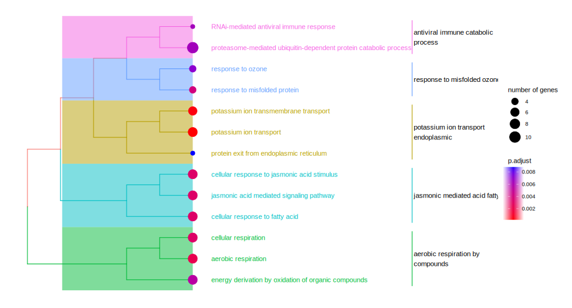
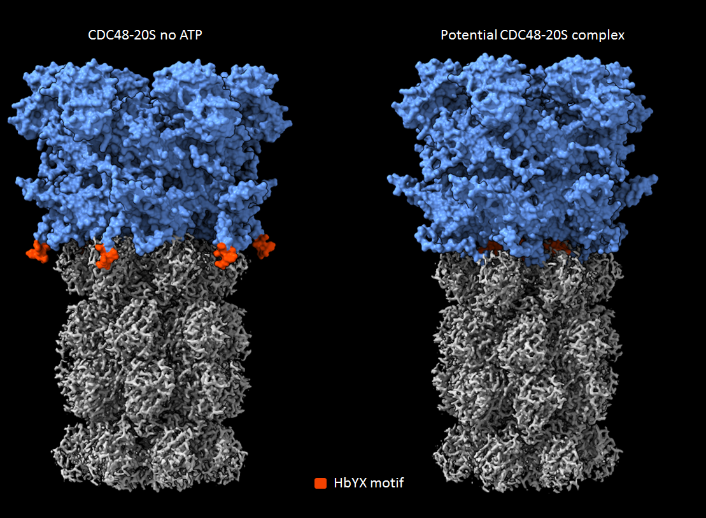

ProEnd Pipeline 1.0
================

# ProEnd Scripts

This project contains two Bash scripts designed to handle and analyze
multiple protein sequences. The scripts streamline the extraction and
identification of specific C-terminal protein HbYX-motifs from a given
FASTA file. The third script shows how to download the proteomes from
UniProt.

If you have just one protein sequence or your file is already one
protein sequence per line go to script 2 \## Scripts

### 1. HbYX-First.bash

This script formats a multi-entry FASTA file into a single line per
entry format, preparing it for further analysis. Use this script first
if you have multiple sequences, a proteome, or alignments.

#### Usage

Ensure you have the necessary FASTA file in the same directory or
specify the path to the file. Execute the script by running:

`./HbYX-First.bash`

or

`bash HbYX-First.bash`

This will output a file named `multifasta.ol.fa`, containing all the
sequences from the original FASTA file, formatted for further
processing.

### 2. HbYX-Second-Script.bash

This script searches for a specific HbYX-motif at the C-terminus of the
protein sequences in the `multifasta.ol.fa` file created by the first
script.

#### Usage

Run the script using:

`./HbYX-Second-Script.bash`

or

`bash HbYX-Second-Script.bash`

It will produce a file named `2aa.txt`, containing the motifs found
along with the corresponding header from the FASTA file, if available.

### Testing ProEND with *Arabidopsis proteome*

Download (Reviewed Swiss-Pro) Arabidopsis [proteome from
Uniprot](https://www.uniprot.org/uniprotkb?query=arabidopsis&facets=reviewed%3Atrue)

#### 1. Fasta linearization

``` bash
zcat Arabidopsis_uniprot_proteome/uniprotkb_arabidopsis_AND_reviewed_true_2024_10_08.fasta.gz | head -n 2
```

    ## >sp|A0A067YMX8|XTH8_DIOKA Xyloglucan endotransglucosylase protein 8 OS=Diospyros kaki OX=35925 GN=XTH8 PE=1 SV=1
    ## MAASPYSIFAVQLLLLASWMLSSSSSNFNQDFNIAWGGGRARILNNGELVTLSLDKASGS

``` bash
bash HbYX-First.awk Arabidopsis_uniprot_proteome/uniprotkb_arabidopsis_AND_reviewed_true_2024_10_08.fasta.gz Arabidopsis_uniprot_proteome/arabidopsis_uniprot_proteome.ol.fa
```

#### 2. HbYX motif prediction

``` bash
bash HbYX-Second-Script.awk  Arabidopsis_uniprot_proteome/arabidopsis_uniprot_proteome.ol_clean.fa  Arabidopsis_uniprot_proteome/arabidopsis_HbyX_proteome.txt
```

Total number of HbYX motif candidates:

``` bash
grep -c ">" Arabidopsis_uniprot_proteome/arabidopsis_HbyX_proteome.txt 
```

    ## 219

#### 3. Exploring conserved HbYX proteasome regulatory protein

``` bash
grep --no-group-separator -A 1 -i "proteasome"  Arabidopsis_uniprot_proteome/arabidopsis_HbyX_proteome.txt 
```

    ## >sp|O04019|PS6AB_ARATH 26S proteasome regulatory subunit 6A homolog B OS=Arabidopsis thaliana OX=3702 GN=RPT5B PE=1 SV=3
    ## YYA
    ## >sp|Q9SEI2|PS6AA_ARATH 26S proteasome regulatory subunit 6A homolog A OS=Arabidopsis thaliana OX=3702 GN=RPT5A PE=1 SV=1
    ## YYA
    ## >sp|Q9SL67|PRS4B_ARATH 26S proteasome regulatory subunit 4 homolog B OS=Arabidopsis thaliana OX=3702 GN=RPT2B PE=1 SV=1
    ## LYM
    ## >sp|Q9SZD4|PRS4A_ARATH 26S proteasome regulatory subunit 4 homolog A OS=Arabidopsis thaliana OX=3702 GN=RPT2A PE=1 SV=1
    ## LYM
    ## >sp|Q9SEI4|PRS6B_ARATH 26S proteasome regulatory subunit 6B homolog OS=Arabidopsis thaliana OX=3702 GN=RPT3 PE=1 SV=1
    ## FYK
    ## >sp|Q9SSB4|PRS7B_ARATH 26S proteasome regulatory subunit 7 homolog B OS=Arabidopsis thaliana OX=3702 GN=RPT1B PE=1 SV=2
    ## YYI
    ## >sp|Q9SSB5|PRS7A_ARATH 26S proteasome regulatory subunit 7 homolog A OS=Arabidopsis thaliana OX=3702 GN=RPT1A PE=1 SV=1
    ## VYN

#### 4. Exploring novel regulatory candidates

Mapping TAIR Arabidopsis IDs using biomaRt

Getting entrezID and running GO terms analysis

``` r
uniprot_ids <- read.csv("Arabidopsis_uniprot_proteome/uniprot_ids.txt", header = F)
ensembl <- useMart("plants_mart", dataset = "athaliana_eg_gene", host = "https://plants.ensembl.org")
mapping <- getBM(
  attributes = c("uniprotswissprot", "entrezgene_id"), # "tair_locus"),
  filters = "uniprotswissprot",
  values = uniprot_ids,
  mart = ensembl
)

all_uniprot_df <- as.data.frame( uniprot_ids)
colnames(all_uniprot_df ) <- c("uniprotswissprot")

uniprot2entrez <- merge(all_uniprot_df, mapping, by = "uniprotswissprot", all.x = TRUE)
print(paste("Uniprot ids:", nrow(uniprot_ids), " Entrez ids:", nrow(mapping), " Non mapped ids:",  nrow(uniprot_ids) -  nrow(mapping), sep = ""))
```

    ## [1] "Uniprot ids:219 Entrez ids:205 Non mapped ids:14"

``` r
#Non mapped IDs
#uniprot2TAIR[is.na(uniprot2TAIR$tair_locus),]

ego <- enrichGO(gene  = uniprot2entrez[!is.na(uniprot2entrez$entrezgene_id),2], 
                OrgDb         = org.At.tair.db,
                ont           = "BP", #"MF"
                pAdjustMethod = "BH",
                pvalueCutoff  = 0.01,
                qvalueCutoff  = 0.05,
                readable      = TRUE) #library(clusterProfiler)

ego_at <- attributes(ego )
Whole_table <- ego_at$result
write.csv(Whole_table, "Arabidopsis_uniprot_proteome/GO_HbYX_Arabidopsis.csv") 
d <- godata('org.At.tair.db', ont="BP") #library(GOSemSim)
```

    ## preparing gene to GO mapping data...

    ## preparing IC data...

``` r
ego2 <- pairwise_termsim(ego, method="Wang", semData = d) #library(enrichplot)
```

<div style="text-align: center;">

<figure>

<figcaption style="margin-top: 10px;">
<strong>GO terms enrichment of Arabidopsis HbYX containing
proteins</strong>
</figcaption>
</figure>

<a name="GO_terms_HbYX"></a>

</div>

#### 5. HbYX protein CDC48A as a potential proteasome regulator

One proposed and controversial candidate for 20S proteasome regulation, significantly
enriched across several Gene Ontology categories, is the CDC48 gene
family, as demonstrated in: <!-- CDC48A (At3g09840) from Arabidopsis 
#head(Whole_table[grepl("proteasome",Whole_table$Description),c(2,3,8)])-->

``` r
head(Whole_table[grepl("CDC48",Whole_table$geneID),c(2,3,8)])
```

    ##                                                          Description GeneRatio
    ## 5                                      response to misfolded protein     4/196
    ## 7  proteasome-mediated ubiquitin-dependent protein catabolic process    10/196
    ## 11                             proteasomal protein catabolic process    10/196
    ## 12                           protein exit from endoplasmic reticulum     3/196
    ## 14                 ER-associated misfolded protein catabolic process     3/196
    ## 17                            cellular response to misfolded protein     3/196
    ##                                                                 geneID
    ## 5                                      ATCDC48/AtCDC48C/AtCDC48B/RPT2a
    ## 7  RPT5B/ATCDC48/AtCDC48C/AtCDC48B/ATS6A.2/RPT3/ARI9/RPT2b/RPT1A/RPT2a
    ## 11 RPT5B/ATCDC48/AtCDC48C/AtCDC48B/ATS6A.2/RPT3/ARI9/RPT2b/RPT1A/RPT2a
    ## 12                                           ATCDC48/AtCDC48C/AtCDC48B
    ## 14                                           ATCDC48/AtCDC48C/AtCDC48B
    ## 17                                           ATCDC48/AtCDC48C/AtCDC48B

#### 6. Reconstruction a potential interaction of CDC48 and the 20S proteasome.

Given its potential, we decided to proceed with an in-silico reconstruction of the CDC48 complex in this example. 
CDC48 contains a well-characterized AAA+ domain, which is typically associated with the formation of a homo-oligomer, 
most commonly a hexamer in proteins of this type. For this reconstruction, AlphaFold V2 Multimer or AlphaFold V3 can be used, 
the latter allowing the inclusion of ligands such as ATP.

<div style="text-align: center;">

<figure>

<figcaption style="margin-top: 10px;">
<strong>CDC-48 Hexamer prediction with and without ATP. HbYX motif in orange
</strong>
</figcaption>
</figure>

<a name="_HbYX"></a>

</div>
As expected, the CDC-48 homohexamer predictions show robust pTM values, with 0.61 in the absence of ATP and 0.55 in the presence of ATP. 
A pTM score above 0.5 indicates that the predicted overall structure of the complex is likely to resemble the true native structure.
Interestingly, the HbYX motif can be observed shifting from the outer structure to the inner portion, a conformational change commonly 
seen in substrate-processing ATPases that interact with the 20S proteasome upon substrate engagement. 
This change facilitates interaction with the 20S proteasome to open the gate for substrate entry.


#### You can proceed with molecular docking of the CDC48 complex with the 20S proteasome using ChimeraX or any preferred molecular docking tool.
<div style="text-align: center;">

<figure>

<figcaption style="margin-top: 10px;">
<strong>Potential CDC48-20S complex formation. HbYX motif in orange. 20S in gray
</strong>
</figcaption>
</figure>

<a name="_HbYX"></a>

</div>

Upon docking, the HbYX motif of CDC48, in the presence of ATP, is positioned optimally for interaction with the alpha pockets of the 20S
proteasome, potentially facilitating gate opening and activation

#### 7. Conclusion and Future Potential.

This example demonstrates how to generate and explore hypotheses using our tool, ProEnd. In this case, we focused on HbYX-containing proteins
from *Arabidopsis thaliana*, one of the most extensively studied model organisms in biology. Using ProEnd, we successfully identified 
known HbYX-containing proteins, including the 19S-26S regulatory proteins, and discovered enriched candidates (CDC48-p97) with potential 
for novel interactions with the 20S proteasome, expanding our understanding of proteasome biology and proteostasis.

The formation of the CDC48-20S complex remains a topic of debate. Some researchers argue that the 19S-20S complexes, also referred to as 26S
proteasomes, represent the vast majority of proteasomes in the cell. However, various cellular contexts demand alternative proteasome
configurations. For instance, there are well-documented cases of 20S complexes interacting with other molecules, such as PA28, PA200, and PI31.
CDC48 is particularly relevant in unique cellular environments that require the degradation of tightly folded substrates. These substrates,
after folding, may directly engage the 20S proteasome without the need for 19S caps, providing a distinct scenario for CDC48-20S complex
formation, potentially in the ER or chloroplast.

The conservation of the HbYX motif in CDC48 across different kingdoms (from archea to eukaryotes) suggests a conserved mechanism for direct
degradation through the 20S proteasome without intermediaries, further supporting the idea that CDC48 plays a crucial role in specific
proteolytic pathways.


## Requirements

- Unix-like environment
- AWK installed

## Installation

No installation is required. Simply clone this repository or download
the scripts to your local machine.

## Data Folder HbYX_data_tables

This folder contains data results files for the ProEnd Scripts project.

## Cite

This code can be cited currently as BioRxiv preprint
\[[1](#ref-salcedo2024proend)\]

## License

The code is freely available to download and run, but it’s protected and
licensed under a [Creative Commons Attribution-ShareAlike 4.0
International License](https://creativecommons.org/licenses/by-nc/4.0/),
meaning you can use it but citing it’s source.

[](https://creativecommons.org/licenses/by-nc/4.0/)

## References

<div id="refs" class="references csl-bib-body">

<div id="ref-salcedo2024proend" class="csl-entry">

1\. Salcedo-Tacuma DM, Howells G, McHose C, Gutierrez-Diaz A, Smith DM.
ProEnd: A comprehensive database for identifying HbYX motif-containing
proteins across the tree of life. bioRxiv. 2024;2024–06.

</div>

</div>
