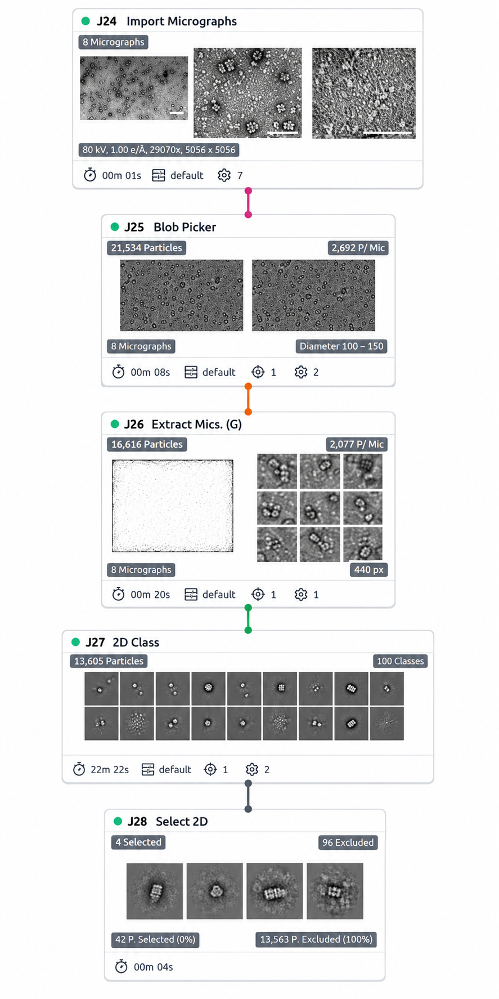
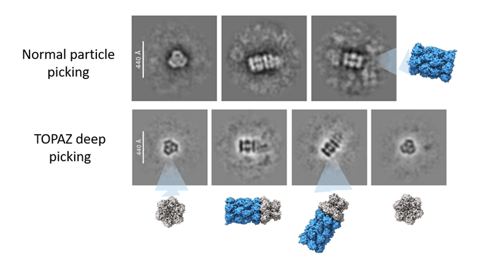
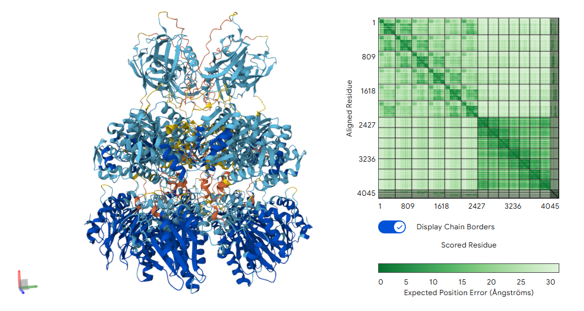

# PAN2 structural follow-up: negative-stain TEM and AlphaFold 3 model

> **Status:** Repository extension in progress. This page documents a structural follow-up to the published ProEnd PAN2 results. The TEM observations and AlphaFold 3 model are complementary, but neither constitutes an experimentally resolved atomic structure.

## Background

ProEnd identified the archaeal PAN2 protein **PAN2_METJA** (UniProt [Q58889](https://www.uniprot.org/uniprotkb/Q58889/entry)) from *Methanocaldococcus jannaschii* as an HbYX-containing proteasome regulator. The published ProEnd study reported PAN2 interaction with and activation of the archaeal 20S proteasome: [Salcedo et al., BMC Genomics (2024)](https://link.springer.com/article/10.1186/s12864-024-10864-4).

The present extension connects that published activity result with two structural observations:

1. negative-stain TEM followed by CryoSPARC particle analysis; and
2. an AlphaFold 3 model of a PAN2 hexamer positioned on the seven-membered alpha ring of the *Thermoplasma acidophilum* 20S proteasome.

---

## 1. Published PAN2 activity

The biochemical activity described in the ProEnd study provides the experimental basis for this structural follow-up.


**Figure 1. Published PAN2 activity result from the ProEnd study.** This panel is reproduced here to connect the previously reported biochemical evidence with the TEM and AF3 observations presented below. The original publication remains the primary source for experimental design, statistics, and interpretation.

---

## 2. Negative-stain TEM and CryoSPARC workflow

PAN2 was recombinantly expressed with a His tag. A Ni-NTA pulldown was performed in the presence of proteasome, and the recovered sample was mounted on carbon-film-coated copper grids. Grids were prepared by a standard negative-stain procedure using **1% uranyl acetate**.

TEM images were acquired at **80 kV** using a **JEOL 1010 transmission electron microscope** equipped with an **AMT Hamamatsu ORCA-HR digital camera**. Eight micrographs were used for the exploratory CryoSPARC workflow.



**Figure 2. CryoSPARC workflow used for exploratory PAN2-T20S particle analysis.** Eight micrographs were imported, particles were detected by blob picking, extracted in 440-pixel boxes, classified into 100 two-dimensional classes, and manually curated. Four selected classes containing 42 particles were retained as candidate PAN2-T20S assemblies for visualization. The low retained particle number means that the selected classes are interpreted qualitatively rather than as a high-resolution reconstruction.

### Workflow summary

| Step | CryoSPARC output | Reported value |
|---|---|---:|
| Import micrographs | Micrographs | 8 |
| Acquisition | Accelerating voltage | 80 kV |
| Acquisition | Exposure setting | 100 |
| Acquisition | Magnification | 29,070x |
| Acquisition | Image dimensions | 5056 × 5056 px |
| Blob picker | Candidate particles | 21,534 |
| Blob picker | Mean candidate particles per micrograph | 2,692 |
| Blob picker | Picking diameter | 100–150 px |
| Extraction | Extracted particles | 16,616 |
| Extraction | Mean extracted particles per micrograph | 2,077 |
| Extraction | Extraction box | 440 px |
| 2D classification | Particles classified | 13,605 |
| 2D classification | Number of classes | 100 |
| 2D selection | Retained classes | 4 |
| 2D selection | Retained particles | 42 |

> The exposure value is reported here as recorded for this test dataset. Add the exact microscope/software unit before final release if available.

---

## 3. Selected 2D classes and visual interpretation

The particle population was heterogeneous. Most classes were excluded during curation, while a small subset contained candidate views compatible with PAN2-T20S assemblies.



**Figure 3. Selected 2D classes and structural guides.** The panel contains the selected CryoSPARC classes together with zoomed-out ChimeraX views intended to help the reader interpret the observed orientations. The molecular views are visual guides and are not fitted reconstructions. The 42 particles retained across four classes are described as candidate PAN2-T20S assemblies; they do not establish stoichiometry, symmetry, resolution, or a unique three-dimensional conformation.

### TEM interpretation

The selected classes provide particle-level observations compatible with PAN2 association with the T20S proteasome. Because this was an eight-micrograph test dataset with a small retained subset, no three-dimensional reconstruction or atomic interface is claimed from the TEM analysis.

---

## 4. PAN2 hexamer prediction

A separate structural visualization shows the predicted PAN2 hexamer and the orientation of the HbYX-containing C-terminal tails.

[Open the PAN2 hexamer prediction video](media/PAN2-Hexamer-Prediction.mp4)

**Video 1. PAN2 hexamer prediction.** This is a rotation of a static structural prediction. It is included to show the overall assembly and the position of the C-terminal regions; it does not represent molecular dynamics or an experimentally observed conformational trajectory.

---

## 5. AlphaFold 3 PAN2 hexamer-T20S alpha-ring model

AlphaFold 3 was used to model six PAN2 chains from *M. jannaschii* together with seven alpha subunits from the *T. acidophilum* 20S proteasome.

### Model composition

| Component | Copy number |
|---|---:|
| PAN2, UniProt Q58889 | 6 chains |
| *T. acidophilum* T20S alpha subunit | 7 chains |
| ATP | 5 |
| ADP | 1 |
| Mg²⁺ | 6 |

The model therefore represents a **PAN2 hexamer-T20S alpha-ring complex**, not the complete four-ring 20S proteasome.

[Open the PAN2-T20S AF3 video](media/PAN2-T20S-Video.mp4)

**Video 2. Rotation of the static AF3 PAN2 hexamer-T20S alpha-ring prediction.** The PAN2 HbYX-containing tails are shown in orange. The animation is intended to display the overall predicted arrangement and does not represent ATP hydrolysis, molecular dynamics, or a time-resolved conformational transition.

---

## 6. Predicted PAN2-T20S interface



**Figure 4. AF3 prediction of the PAN2-T20S alpha-ring interface, colored by pLDDT.** The model positions the PAN2 C-terminal regions near the alpha-ring intersubunit pockets, providing a structural hypothesis for HbYX-dependent engagement. Confidence coloring should be interpreted together with the global AF3 scores and does not by itself validate the atomic interface.

### AF3 confidence summary

| Metric | Value |
|---|---:|
| ipTM | 0.54 |
| pTM | 0.56 |

The moderate scores support using the model as a working structural hypothesis rather than as a definitive interface assignment.

---

## 7. Integrated interpretation

The published biochemical data established PAN2 as a candidate archaeal 20S proteasome regulator. The negative-stain TEM test dataset adds a small set of candidate particle classes compatible with PAN2-T20S assemblies. The AF3 prediction, in turn, proposes a possible arrangement of the PAN2 hexamer on the T20S alpha ring and places the PAN2 C-terminal regions near the alpha-subunit pockets.

Together, these observations extend the ProEnd PAN2 case study from sequence-based discovery and biochemical activity toward a structural working model. The TEM data provide qualitative particle-level support, whereas the AF3 model supplies an atomic hypothesis that remains to be experimentally validated.

---

## Files expected in this extension

Upload the final assets to these exact paths on the branch `docs/pan2-tem-af3-update`:

```text
docs/pan2-extension/
├── README.md
├── figures/
│   ├── PAN-2-Activity_proend.png
│   ├── pan2-cryosparc-workflow.png
│   ├── pan2-2d-classes.png
│   └── pan2_t20s_af3.png
└── media/
    ├── PAN2-Hexamer-Prediction.mp4
    └── PAN2-T20S-Video.mp4
```

---

## Final checks before linking from the main README

- [ ] Upload all six files using the exact names and paths above.
- [ ] Confirm that the exposure value and its unit are represented correctly.
- [ ] Confirm whether the published activity panel requires an additional attribution note.
- [ ] Verify that both MP4 links open from GitHub.
- [ ] Review all captions and terminology.
- [ ] Add a short preview and link from the main README only after this page is approved.
