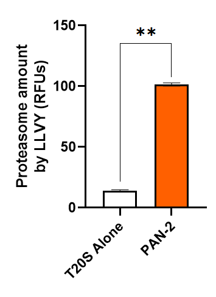
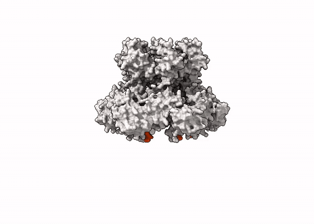
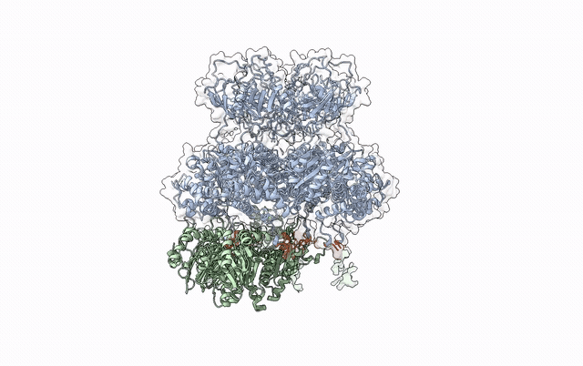

## Case study: PAN-2 structural follow-up: negative-stain TEM and AlphaFold 3 model
### Background

ProEnd identified the archaeal PAN2 protein **PAN2_METJA** (UniProt [Q58889](https://www.uniprot.org/uniprotkb/Q58889/entry)) from *Methanocaldococcus jannaschii* as an HbYX-containing proteasome regulator. The published ProEnd study reported PAN2 interaction with and activation of the archaeal 20S proteasome: [Salcedo et al., BMC Genomics (2024)](https://link.springer.com/article/10.1186/s12864-024-10864-4). After its identification we havetwo structural observations:

---
#### PAN2 activity and structural prediction

<table>
<tr>

<td width="30%" valign="top" align="center">
  

</td>
<td width="70%" valign="top" align="center">

  

</td>

</tr>
</table>

<strong>(Left).</strong>
<strong></strong> PAN2 increased T20S proteasome activity relative to
T20S alone. Because PAN2 is closely related to the
proteasome-activating nucleotidase PAN, it was modeled in AlphaFold as a homohexameric
assembly <strong>(Right)</strong>. The prediction provided us a structural framework for examining the
organization of the PAN2 ATPase domains and the positions of its
HbYX-containing C-terminal tails, shown in orange.The published biochemical activity and the predicted
homohexameric organization motivated the follow-up investigation of
potential PAN2–T20S complex formation.

---

### 2. Structural Approaches: Negative stain TEM followed by Single Particle Analysis (SPA) with CryoSPARC
Briefly, PAN2 was recombinantly expressed with a His tag. A Ni-NTA pulldown was performed in the presence of proteasome, and the recovered sample was mounted on carbon film-coated copper grids. Grids were prepared using a standard negative-stain procedure with **1% uranyl acetate**. The TEM images were acquired at **80 kV** using a **JEOL 1010 transmission electron microscope** equipped with an **AMT Hamamatsu ORCA-HR digital camera**. For this proof of concept eight micrographs were used in the exploratory SPA CryoSPARC workflow.

<table>
<tr>

<td width="48%" valign="top" align="center">

</td>

<td width="52%" valign="top">

<h3>Workflow summary</h3>

<table>
<thead>
<tr>
<th align="left">Step</th>
<th align="left">Output</th>
<th align="right">Value</th>
</tr>
</thead>

<tbody>
<tr>
<td>Import</td>
<td>Micrographs</td>
<td align="right">8</td>
</tr>

<tr>
<td>Acquisition</td>
<td>Accelerating voltage</td>
<td align="right">80 kV</td>
</tr>

<tr>
<td>Acquisition</td>
<td>Magnification</td>
<td align="right">29,070×</td>
</tr>

<tr>
<td>Acquisition</td>
<td>Image dimensions</td>
<td align="right">5056 × 5056 px</td>
</tr>

<tr>
<td>Blob picker</td>
<td>Candidate particles</td>
<td align="right">21,534</td>
</tr>

<tr>
<td>Blob picker</td>
<td>Particles per micrograph</td>
<td align="right">2,692</td>
</tr>

<tr>
<td>Blob picker</td>
<td>Picking diameter</td>
<td align="right">100–150 px</td>
</tr>

<tr>
<td>Extraction</td>
<td>Extracted particles</td>
<td align="right">16,616</td>
</tr>

<tr>
<td>Extraction</td>
<td>Particles per micrograph</td>
<td align="right">2,077</td>
</tr>

<tr>
<td>Extraction</td>
<td>Extraction box</td>
<td align="right">440 px</td>
</tr>

<tr>
<td>2D classification</td>
<td>Particles classified</td>
<td align="right">13,605</td>
</tr>

<tr>
<td>2D classification</td>
<td>Classes</td>
<td align="right">100</td>
</tr>

<tr>
<td>2D selection</td>
<td>Retained classes</td>
<td align="right">4</td>
</tr>

<tr>
<td>2D selection</td>
<td>Retained particles</td>
<td align="right">42</td>
</tr>
</tbody>
</table>

</td>
</tr>
</table>

<strong>Figure 1. CryoSPARC workflow.</strong>
Particles were detected by blob picking, extracted in 440-pixel boxes,
classified into 100 two-dimensional classes, and manually curated.
Four selected classes containing 42 particles were retained as candidate
PAN2–T20S assemblies for visualization.

---

### 3. Selected 2D classes and visual interpretation
The particle population was heterogeneous. Most classes were excluded during curation, while a small subset contained candidate views compatible with PAN2-T20S assemblies.Additionally, we use denoise models and deep picking models to improve the contrast of the images and the quality of the picked particles.

**Figure 2. Selected 2D classes.** The panel contains the selected CryoSPARC classes with normal picking methods and with deep learning picking models (TOPAZ) together with zoomed-out ChimeraX views of the structure intended to help the reader interpret the observed orientations. The molecular views are visual guides and are not fitted reconstructions. The particles retained across four classes are candidate PAN2-T20S assemblies.

---
#### 4. PAN2 hexamer–T20S α-ring prediction.
The negative-stain TEM data revealed particles consistent with PAN2–T20S complex formation. However, further optimization will be required to obtain enough high-quality particles for robust single particle analysis and, ultimately, a high-resolution reconstruction of the complex. 

While these experimental conditions are being optimized, we used AlphaFold 3 (AF3) to explore a possible molecular arrangement of the PAN2–T20S interaction. AF3 can model oligomeric assemblies and protein–protein interfaces while incorporating ligands and metal ions. Based on the known biochemistry of PAN family proteasome activators, we modeled the PAN2 hexamer in the presence of ATP, ADP, and Mg²⁺. 

Because of AF3 input size limitations, we modeled the minimal proteasomal unit required to investigate the interaction: the seven subunit α-ring of the archaeal 20S proteasome. For this component, we used the well-characterized α-subunit from the *Thermoplasma acidophilum* T20S proteasome. The resulting model produced a structurally plausible PAN2 hexamer–α-ring assembly and a candidate interface for HbYX-dependent proteasome engagement :
<table>
<tr>

<td width="85%" valign="top" align="center">

</td>

<td width="15%" valign="top">

<strong><small>AF3 confidence</small></strong>

<table>
<tr>
<td><small>ipTM</small></td>
<td align="right"><small>0.54</small></td>
</tr>
<tr>
<td><small>pTM</small></td>
<td align="right"><small>0.56</small></td>
</tr>
</table>

 

<strong><small>Model composition</small></strong>

<table>
<tr>
<td><small>PAN2, Q58889</small></td>
<td align="right"><small>6 chains</small></td>
</tr>
<tr>
<td>
  <small><em>T. acidophilum</em> T20S α-subunit</small>
</td>
<td align="right"><small>7 chains</small></td>
</tr>
<tr>
<td><small>ATP</small></td>
<td align="right"><small>5</small></td>
</tr>
<tr>
<td><small>ADP</small></td>
<td align="right"><small>1</small></td>
</tr>
<tr>
<td><small>Mg2+</small></td>
<td align="right"><small>6</small></td>
</tr>
</table>

</td>
</tr>
</table>

<strong>Figure 3. Predicted PAN2–T20S α-ring interface.</strong>
AF3 model of PAN2 hexamer from
<em>Methanocaldococcus jannaschii</em> positioned on the α-ring of the <em>Thermoplasma acidophilum</em> T20S proteasome.
The static interface view is colored by pLDDT and positions the PAN2
C-terminal regions in the α-ring intersubunit pockets as expected for a canonical HbYX interaction.

The ipTM and pTM scores indicate moderate confidence in the predicted
complex. This model is therefore interpreted as a working structural
hypothesis rather than as a definitive atomic interface. A close depiction of the "docked" region:

<table>
<tr>

<td width="60%" valign="top" align="center">

</td>

<td width="40%" valign="top">

<strong>Gif 2. PAN2–T20S.</strong>
The PAN2 HbYX containing C-terminal tails are shown in orange. The GIF provides a detailed view of their predicted docking into the intersubunit pockets of the T20S α-ring. Selected α-ring densities and helices, shown in green, were hidden to improve visualization of the HbYX pocket interaction. The α-subunit residue Lys66 (K66) remains visible to illustrate how the predicted interface is compatible with the canonical model of HbYX-dependent proteasome engagement. 

The animation represents a rotation of a static AF3 prediction and not a molecular-dynamics simulation.

</td>
</tr>
</table>

## Integrated interpretation

This predicted interaction is consistent with the canonical mechanism of archaeal proteasome engagement. In the well characterized PAN–20S system, the C-terminal HbYX motifs of PAN dock into pockets between adjacent α-subunits, inducing local conformational changes associated with opening of the proteasomal gate [[1]](#ref-yu2010). The positioning of the PAN2 HbYX tails in our AF3 model is therefore compatible with an established mechanism of archaeal proteasome activation. However, the predicted contacts should not be considered atomic validation of the interface.

The presence of more than one PAN related ATPase is not unique to *Methanocaldococcus jannaschii*. Several haloarchaea and methanogens encode two PAN homologs. Experimental studies in *Halobacterium* and *Haloferax volcanii* have shown differences in proteasome association, expression, regulation, and cellular phenotypes between PAN paralogs, suggesting that they may not be functionally redundant [[2]](#ref-reuter2008) [[3]](#ref-reuter2004). Nevertheless, the physiological division of labor between archaeal PAN paralogs remains incompletely resolved.

In *M. jannaschii*, the canonical proteasome-activating nucleotidase PAN, UniProt Q58576, is present alongside PAN2, UniProt Q58889. PAN2 should therefore be considered a second PAN related ATPase rather than a replacement for canonical PAN. This coexistence raises the possibility that the two ATPases differ in substrate recognition, stress-dependent regulation, proteasome affinity, or additional cellular functions.

Another potentially interesting feature is the comparatively compact distal architecture observed in the PAN2 prediction. Canonical *M. jannaschii* PAN contains an N-terminal distal region formed by coiled-coil and OB-fold elements that contribute to substrate recognition and define the entrance to the translocation channel [[4]](#ref-zhang2009). In contrast, the current PAN2 model appears to contain a smaller distal cap. This difference may indicate that the corresponding elements are shortened, reorganized, or structurally divergent in PAN2.

*M. jannaschii* is a hyperthermophilic methanogen originally isolated from a deep-sea hydrothermal vent [[5]](#ref-susanti2019). Its ecology makes it interesting to investigate whether PAN2 contributes to proteostasis under high-temperature or other vent associated environmental stresses. The current biochemical, TEM, and AF3 observations do not yet establish such a physiological role, but they provide a basis for testing this hypothesis.

---
### References

1. Yu Y, et al. Interactions of PAN's C-termini with archaeal 20S proteasome and implications for the eukaryotic proteasome–ATPase interactions. *EMBO Journal*. 2010. [https://doi.org/10.1038/emboj.2009.382](https://doi.org/10.1038/emboj.2009.382)

2. Reuter CJ, et al. The two PAN ATPases from *Halobacterium* display N-terminal heterogeneity and form labile complexes with the 20S proteasome. *Biochemical Journal*. 2008. [https://doi.org/10.1042/BJ20071502](https://doi.org/10.1042/BJ20071502)

3. Reuter CJ, et al. Differential regulation of the PanA and PanB proteasome-activating nucleotidase and 20S proteasomal proteins of the haloarchaeon *Haloferax volcanii*. *Journal of Bacteriology*. 2004. [https://pmc.ncbi.nlm.nih.gov/articles/PMC524898/](https://pmc.ncbi.nlm.nih.gov/articles/PMC524898/)

4. Zhang F, et al. Structural insights into the regulatory particle of the proteasome from *Methanocaldococcus jannaschii*. *Molecular Cell*. 2009. [https://doi.org/10.1016/j.molcel.2009.04.021](https://doi.org/10.1016/j.molcel.2009.04.021)

5. Susanti D, et al. A genetic system for *Methanocaldococcus jannaschii*: an evolutionarily deeply rooted hyperthermophilic methanarchaeon. *Frontiers in Microbiology*. 2019. [https://doi.org/10.3389/fmicb.2019.01256](https://doi.org/10.3389/fmicb.2019.01256)

---
